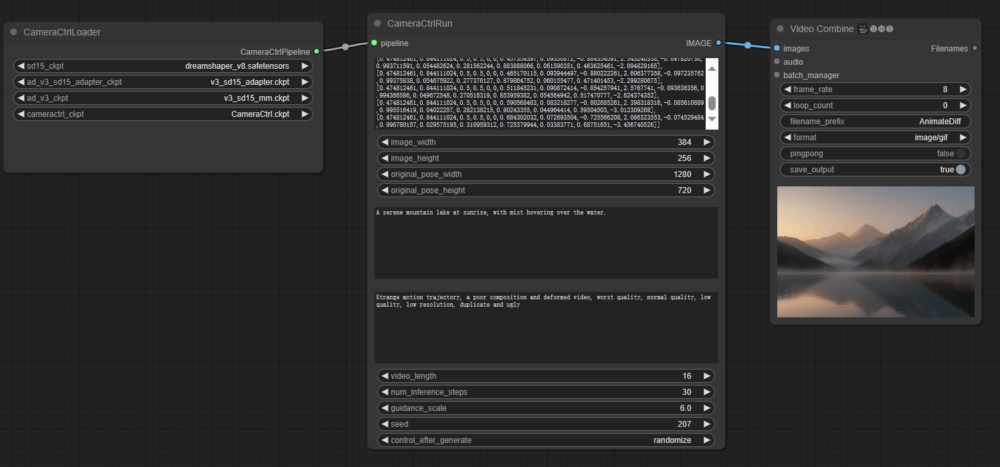

# ComfyUI-CameraCtrl

## workflow

[basic](https://github.com/chaojie/ComfyUI_CameraCtrl/blob/main/workflow/wf.json)

### 1、Model Weights
| Name | Type | Storage Space | Url | Description |
|--|--|--|--|--| 
| CameraCtrl.ckpt | CameraCtrl | 2.6GB | [download](https://huggingface.co/hehao13/CameraCtrl/blob/main/CameraCtrl.ckpt) | ComfyUI/models/checkpoints |
| v3_adapter_sd_v15.ckpt | AD V3 Adapter | 97.4 MB | [download](https://huggingface.co/guoyww/animatediff/blob/main/v3_sd15_adapter.ckpt)| ComfyUI/models/loras |
| v3_sd15_mm.ckpt.ckpt | Pixart | 1.5GB | [download](https://huggingface.co/guoyww/animatediff/blob/main/v3_sd15_mm.ckpt)| ComfyUI/models/animatediff_models |

## [CameraCtrl](https://github.com/hehao13/CameraCtrl)